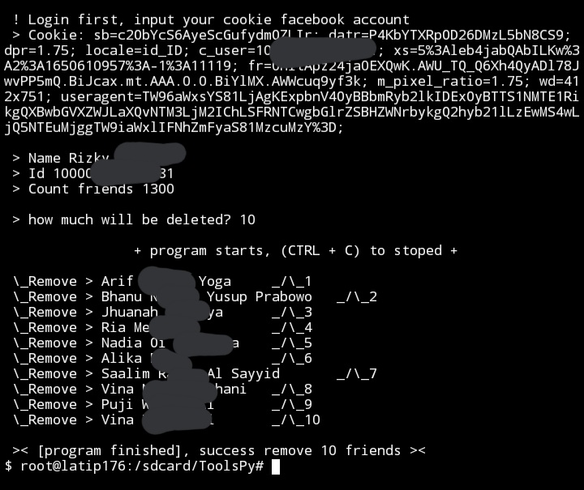

# friends_remover
Facebook friends remover, fast
# login tools
To use this tool, you must have cookies on your Facebook account.<br/>
you can get your facebook account cookies, by using the chrome extension or if you are on a android / ios, you can get them by installing the <a href="https://play.google.com/store/apps/details?id=com.kiwibrowser.browser">kiwi browser</a>
# install
```
pkg install git -y
pkg install python -y
python3 -m pip install requests bs4
git clone https://github.com/Latip176/friends_remover
cd friends_remover
python main.py
```
# support platforms
<li>[x] Windows</li>
<li>[x] Linux</li>
<li>[x] Android~**Termux**</li>
<li>[x] MacOs</li>
<li>[x] **any Os has python(3.x) with required modules**</li>
# sample results

